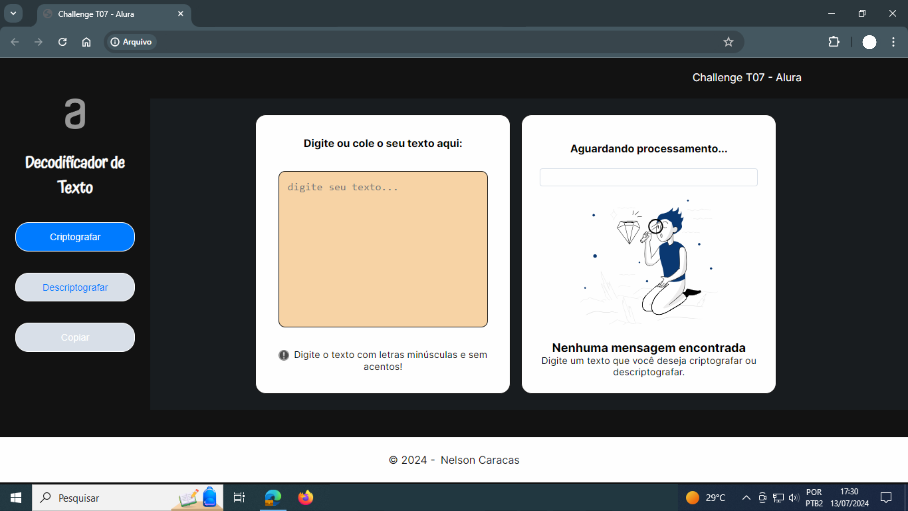

# Decodificador de Texto

## Descrição

O projeto 'Decodificador de Texto' é um desafio 'Challenge' proposto na fase inicial de classificação para uma vaga de especialização em Front-End do programa ONE em parceria com a Alura e o Potência Tech powered by iFood.

## Funcionalidades

- Criptografia e descriptografia de textos curtos;
- Cópia para a área de tranferência;
- Responsivo para telas menores;
- Aplicação Web.

## Deploy

https://decodificador-alura-black.vercel.app

## Desenvolvedor

- Desenvolvido em julho/2024 por: [Nelson Caracas](https://www.github.com/ncaracas)

